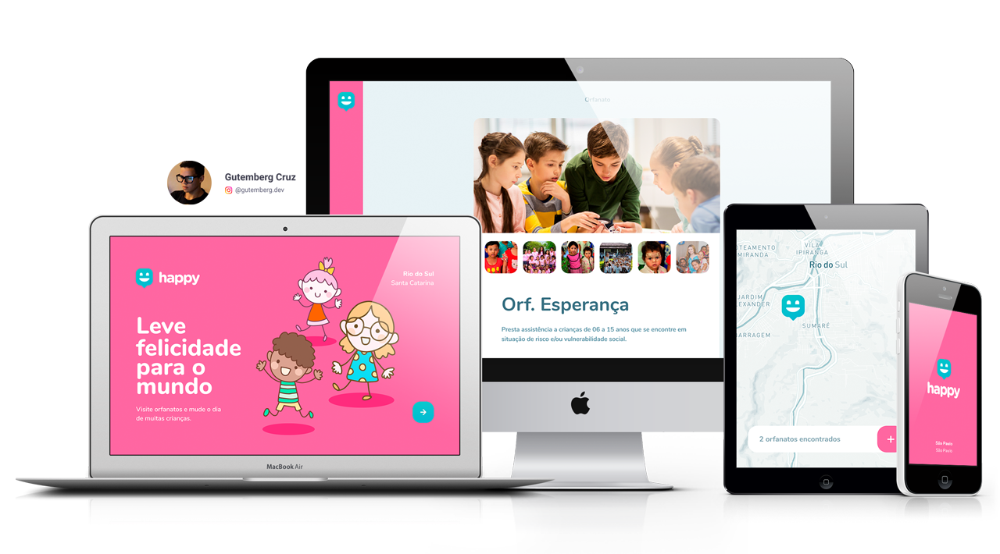

<h1 align="center">
    
</h1>

<h4 align="center">
  🚀 Next Level Week #03
</h4>

 

  

## :rocket: Technologies

This project was developed with the following technologies:

- [Node.js](https://nodejs.org/en/)
- [React](https://reactjs.org)
- [React Native](https://facebook.github.io/react-native/)
- [Expo](https://expo.io/)
- [Leaflet](https://react-leaflet.js.org/)

## 💻 Project

In honor of children's day, in this edition of Next level week we made Happy, a platform whose main purpose is to facilitate and promote visits to children's homes.
